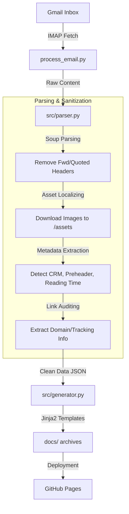

# 📬 Newsletter Archiver

An automated DevOps solution that captures incoming newsletters from Gmail, sanitizes them, and archives them as a static, responsive website hosted on GitHub Pages.

---

## 🏗️ Technical Architecture & Data Flow

This project is designed for automated ingestion and high-fidelity archival. Below is the technical breakdown for developers and LLMs.

### Granular Data Pipeline

---

## 🛠️ Component Map

| Component | File Path | Responsibility |
| :--- | :--- | :--- |
| **Orchestrator** | `process_email.py` | Main entry point. Handles Gmail auth, IMAP fetching, and triggers parsing/generation. |
| **Parser** | `src/parser.py` | `EmailParser` class. Handles BeautifulSoup logic, image localization, tracking pixel detection, and link metadata extraction (domain/tracking). |
| **Generator** | `src/generator.py` | Render logic using Jinja2 templates (`templates/`). Handles the creation of `index.html` and individual `viewer.html` files. |
| **Viewer UI** | `templates/viewer.html` | The responsive dashboard for emails. Contains the fixed sidebar, mobile simulator, and link interaction logic (Spotlight, Overlays). |
| **Theme & UX** | `src/assets/js/main.js` | Client-side logic for theme toggling, search filtering, and "Smart Inversion" dark mode. |
| **Manual Injector** | `injector.py` | Streamlit app for out-of-band archival. Fixes lazy-loading and relative paths. |

---

## 🧠 Key Technical Concepts

### 1. Smart Inversion Dark Mode
Instead of complex CSS re-theming of unknown email HTML, we apply a global filter to the email iframe: `filter: invert(1) hue-rotate(180deg)`.
- **Spotlight Problem**: Shadows and highlights are inverted. We use "Pre-inverted" CSS variables in `viewer.html` so that when the filter is applied, they flip back to the intended colors (e.g., purple inverts to green highlights).

### 2. Multi-Zone Link Cards
Links are parsed into structured objects:
- **Header**: Index, Clean Domain, Tracking Tag.
- **Body**: Anchor text.
- **URL Zone**: Monospace URL + clipboard interaction with visual feedback.

### 3. Dynamic Badge Overlays
Since email HTML is sandboxed in an iframe, link numbering badges are rendered in the **parent** window using absolute positioning calculated via `getBoundingClientRect()`. 
- **Clipping Logic**: Badges are hidden if the target link scrolls out of the iframe viewport.

---

## 🤖 Contributing Guidelines (For Humans & AI)

1. **Parser Changes**: When adding new metadata, update the `EmailParser` in `src/parser.py` first. Ensure the dictionary returned is compatible with Jinja2 expectations.
2. **Template Updates**: Updates to `templates/viewer.html` must maintain the JS-based sidebar logic. Be careful with variable escaping when injecting JSON into script tags.
3. **Asset Isolation**: All archived images MUST be saved to `docs/assets/` to ensure offline/long-term availability.
4. **CSS Architecture**: Use the Dracula-inspired color palette defined in `src/assets/css/style.css`.

---

## 🔧 Setup
1. **Gmail**: Use an App Password and the label `Github/archive-newsletters`.
2. **Secrets**: Set `GMAIL_USER` and `GMAIL_PASSWORD` in GitHub Repo Secrets.
3. **Streamlit**: (Optional) Run `streamlit run injector.py` for manual uploads.

---

## ⚖️ Legal & Privacy
- **Author**: Benoît Prentout
- **License**: MIT
- Contents remain the property of their respective authors. This is a technical demonstration.
