# 📬 Newsletter Archiver

An automated DevOps solution that captures incoming newsletters from Gmail, sanitizes them, and archives them as a static, responsive website hosted on GitHub Pages.

---

## 🚀 Key Features

### 📥 Smart Ingestion
* **Automated Fetching**: Retrieves emails from Gmail via IMAP using specific alias/filter strategies.
* **Sanitization**: Automatically strips "Forward" headers (`Fwd:`, `Tr:`) and quoted history to keep only the original content.
* **Asset Preservation**: Downloads remote images locally to ensure long-term availability and privacy.

### 📱 Modern Viewer Experience
* **Responsive Design**: Toggle between **Desktop** and **Mobile** views to inspect how newsletters render on different devices.
* **Dark Mode**: Intelligent dark mode that inverts text but preserves image quality.
* **Metadata Rich**: Displays **Reading Time**, **Sender**, **Sent Date**, and **Preheader** preview.
* **Internationalization (i18n)**: Switch the entire interface between **English** and **French**.
* **Non-Destructive**: Uses a smart CSS injection strategy to preserve the original email layout (backgrounds, tables) while ensuring readability on small screens.

### ⚙️ Automation & CI/CD
* **Scheduled Runs**: GitHub Actions workflow runs periodically (e.g., every 30 mins) to check for new emails.
* **Static Generation**: Auto-generates a searchable `index.html` hub.

---

## 💉 Manual Injector (Streamlit)

A companion web app to manually archive newsletters by pasting their HTML content.

* **Fixes Broken Images**: Automatically converts relative image paths to absolute URLs using a base URL.
* **Lazy Loading Support**: Detects and fixes lazy-loaded images (`data-src`) for proper archiving.
* **Bypasses Filters**: Useful for newsletters that don't pass through the Gmail automated filter.

---

## 🛠️ Tech Stack

* **Core:** 
* **Parsing:** `BeautifulSoup4` (HTML Cleaning & Metadata Extraction)
* **Email:** `imaplib`, `smtplib`
* **Frontend:** HTML5, CSS3 (Variables, Flexbox, Grid), JavaScript (LocalStorage for preferences)
* **Automation:** 
* **Hosting:** 

---

## ⚙️ Architecture

```mermaid
graph LR;
    subgraph Sources
        Nat["📩 External Newsletters<br>(Natural Flow)"] --> Gmail;
        Inj["💉 Streamlit Injector<br>(Manual Flow)"] -- "SMTP" --> Gmail;
    end

    Gmail["Gmail<br>(Alias + Filter)"] -- "IMAP Fetch" --> Script("🐍 Python Script<br>(GitHub Actions)");
    
    subgraph Processing
        Script -- "1. Extract & Clean" --> HTML["Sanitized HTML"];
        Script -- "2. Download Assets" --> Img["Local Images"];
    end
    
    HTML & Img --> Repo["📂 GitHub Repository<br>(/docs folder)"];
    Repo -- "Auto Deploy" --> Page["🌐 GitHub Pages Website"];

```

---

## 🔧 Setup & Configuration
### 1. Gmail Configuration
* **Alias:** Use an alias (e.g., `you+news@gmail.com`) to subscribe to newsletters.
* **Filter:** Create a filter to apply the label `Github/archive-newsletters` to these emails.
* **Security:** Generate an **App Password** in your Google Account (required for IMAP).

### 2. Repository Secrets
Go to `Settings` > `Secrets and variables` > `Actions` and add:
* `GMAIL_USER`: Your email address.
* `GMAIL_PASSWORD`: The App Password generated above.

### 3. GitHub Pages
Go to `Settings` > `Pages`:
* **Source:** Deploy from a branch.
* **Branch:** `main`.
* **Folder:** `/docs` (root folder).

---

## ⚖️ Legal & Privacy

* **Publisher:** Benoît Prentout
* **Hosting:** GitHub Inc.
* **Content:** This is a personal archive for portfolio and technical demonstration purposes. Newsletter contents remain the property of their respective authors.

---

## 👤 Author

**Benoît Prentout**
* GitHub: [@benoit-prentout](https://github.com/benoit-prentout)

---

## 📄 License

This project is licensed under the MIT License - see the [LICENSE](LICENSE) file for details.
